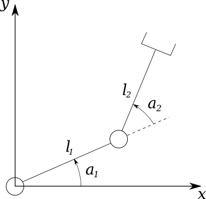

ErrorProp
=========

TODO: writeme 

Error propagation library.

Example 1: Two Link Planar Arm
----------------------------

Let's simulate a non-linear transformation by combining translations 
and rotations of a robotic arm and evaluating error propagation at different
operation points.


Figure 1. A two link planar robotic arm

```haskell
import Math.ErrorProp

-- coordinates
x = var "x"
y = var "y"

-- model parameters
a1 = var "a1"
a2 = var "a2"
l1 = var "l1"
l2 = var "l2"

-- couple of helper functions for defining rotations and translations
rotGen var = 
  [[cos(var), -sin(var), 0]
  ,[sin(var),  cos(var), 0]
  ,[0,         0,        1]]

transGen x y = 
 [[1, 0, x]
 ,[0, 1, y]
 ,[0, 0, 1]]


-- our two link planar arm can now be modeled as superposition of
-- two rotations and two translations
arm1 = (rotGen a1) >< (transGen l1 0) >< (rotGen a2) >< (transGen l2 0)

-- since we are using homogenous coordinates we multiply arm1 with [x, y, 1]
armT1 = nlt (arm1 >. [x, y, 1])
```

We can view our set of resulting functions:

```haskell
print armT1
```
```
o1 = (((x * ((cos(a2) * cos(a1)) + (sin(a2) * -sin(a1)))) + (y * ((-sin(a2) * cos(a1)) + (cos(a2) * -sin(a1))))) + ((l2 * ((cos(a2) * cos(a1)) + (sin(a2) * -sin(a1)))) + (l1 * cos(a1))))
o2 = (((x * ((cos(a2) * sin(a1)) + (sin(a2) * cos(a1)))) + (y * ((-sin(a2) * sin(a1)) + (cos(a2) * cos(a1))))) + ((l2 * ((cos(a2) * sin(a1)) + (sin(a2) * cos(a1)))) + (l1 * sin(a1))))
o3 = 1.0
```

We could easily eliminate x and y from the equations as we know the initial coordinates (0,0).
This can be done in two ways:


1. Reevaluate our matrix-vector multiplication from above:

```haskell
armT2 = nlt (arm1 >. [0,0,1])
```

2. Or use our partialEval utility function

```haskell
armT2 = nlt (partEval (arm1 >. [x,y,1]) [(x,0), (y,0)])
```

And  the order of input parameters would be:
```haskell
print (variables armT1)
```

```
[a1,a2,l1,l2,x,y]
```

```haskell
print (variables armT2)
```
```
[a1,a2,l1,l2]
```
TODO: this section has errors, reevaluate and fix.
--------------------------------------------------77;10102;0c

Now let's evaluate how uncertainties propagate through our model in different operating points

```haskell
degrad a = a/180*pi

print $ transform armT1 $ um [degrad 45, degrad 0, 10, 5, 0, 0] [0, 0, 0, 0, 0, 0]
```

```
x                   var
-10.606601717798211 0.0
10.606601717798213  0.0
1.0                 0.0
```
An expected result.
Now let's spice it up. We can measure angle with variance 1 and length with 0.01.

At 45 degrees:

```haskell
print $ transform armT1 $ 
   um [degrad 45, degrad 0, 10, 5, 0, 0] [degrad 1, degrad 1, 0.01, 0.01, 0, 0]
```
```
x              Cov
-10.60660171   2.1916    2.17166  0.0
10.60660171    2.171661  2.19166  0.0
1.0            0.0       0.0      0.0
```

```haskell
print $ transform armT1 $ 
   um [degrad 0, degrad 0, 10, 5, 0, 0] [degrad 1, degrad 1, 0.01, 0.01, 0, 0]
```
```
x              var
0.0            4.363323129985823
15.0           2.0e-2
1.0            0.0
```

```haskell
print $ transform armT1 $ 
   um [degrad (-90), degrad 0, 10, 5, 0, 0] [degrad 1, degrad 1, 0.01, 0.01, 0, 0]
```
```
x              Cov
15.0           2.0e-2   -2.6595e-16 0.0
9.1848e-16    -2.65e-16  4.3633     0.0
1.0            0.0       0.0        0.0
```
